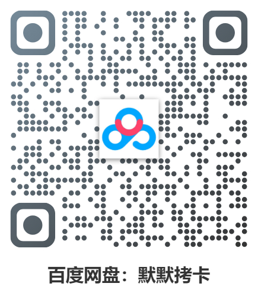

  

# momoKaoka-release
把相机、无人机等设备的存储卡（SD / TF / CFexpress 等）里的素材，安全、快速、按规则分类拷贝到本地硬盘的 Windows 桌面工具。

## 说明

原仓库（已私有）：[hcllmsx/momoKaoka](https://github.com/hcllmsx/momoKaoka)

本仓库只是作为**默默拷卡**的软件发行仓使用。

## 下载方式

扫码通过网盘下载最新版本：

  
  &nbsp;&nbsp;&nbsp;&nbsp;
  

